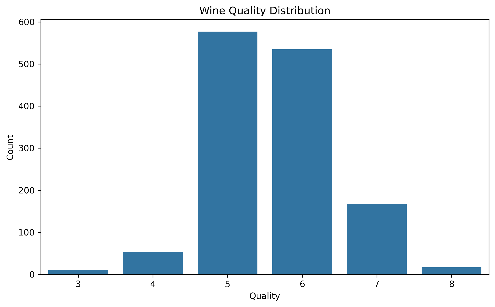
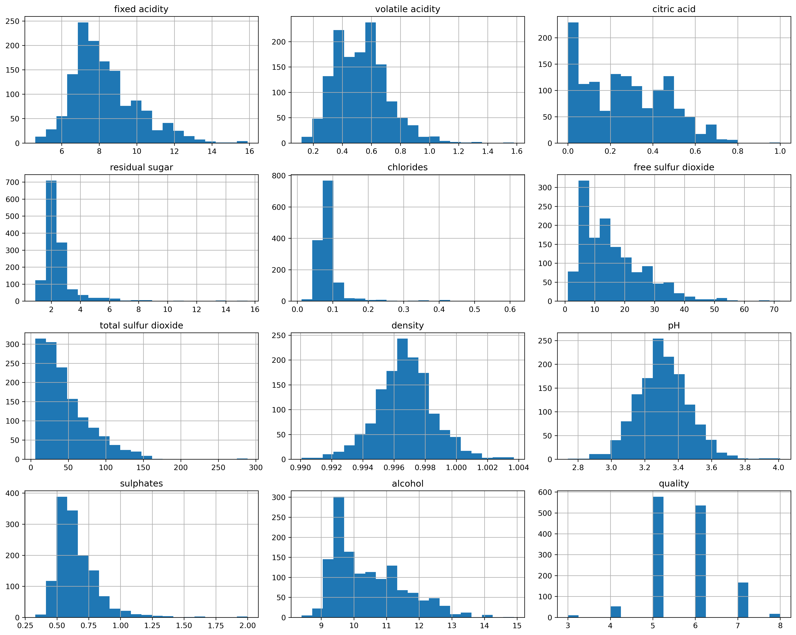
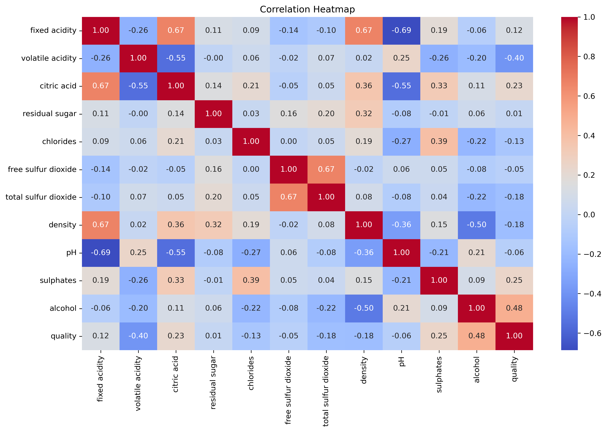
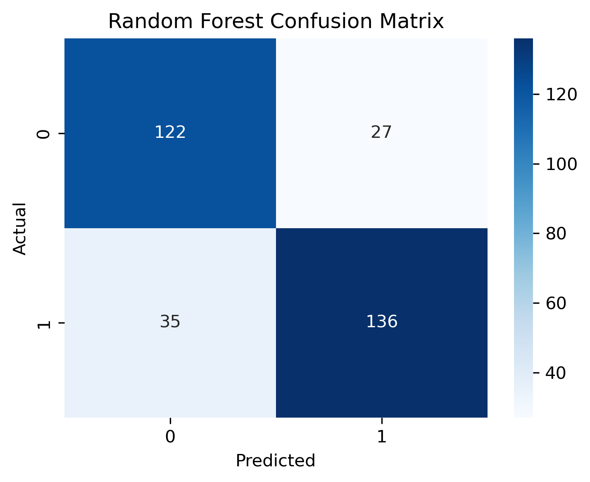
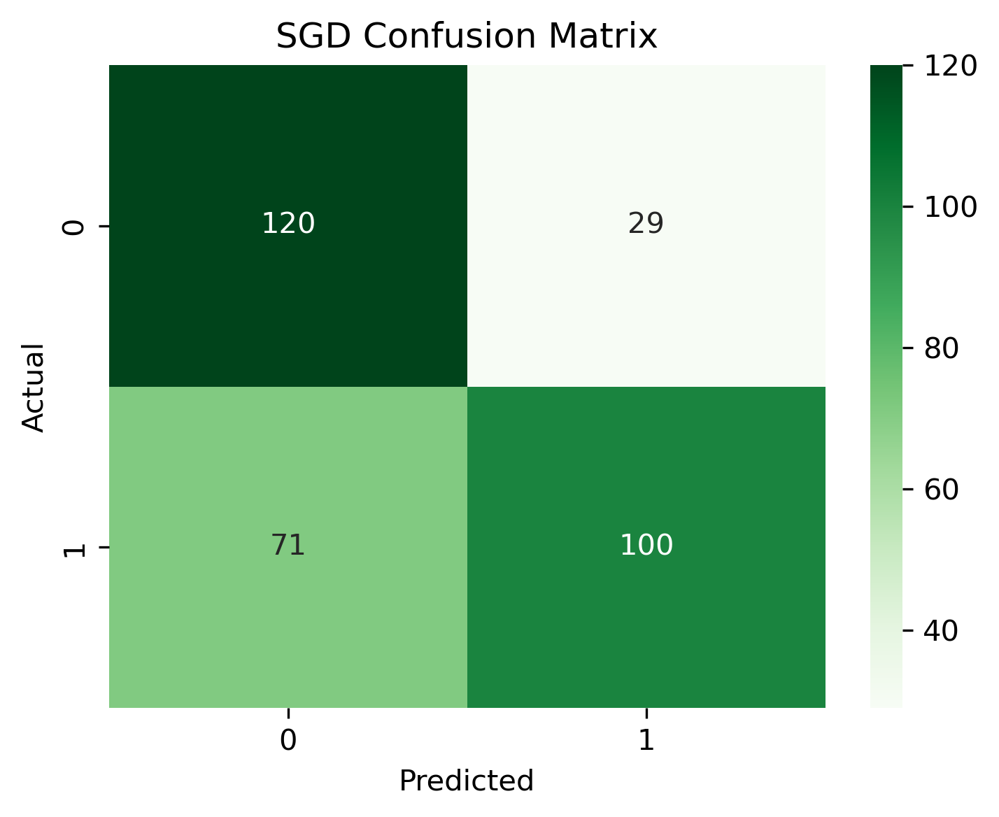
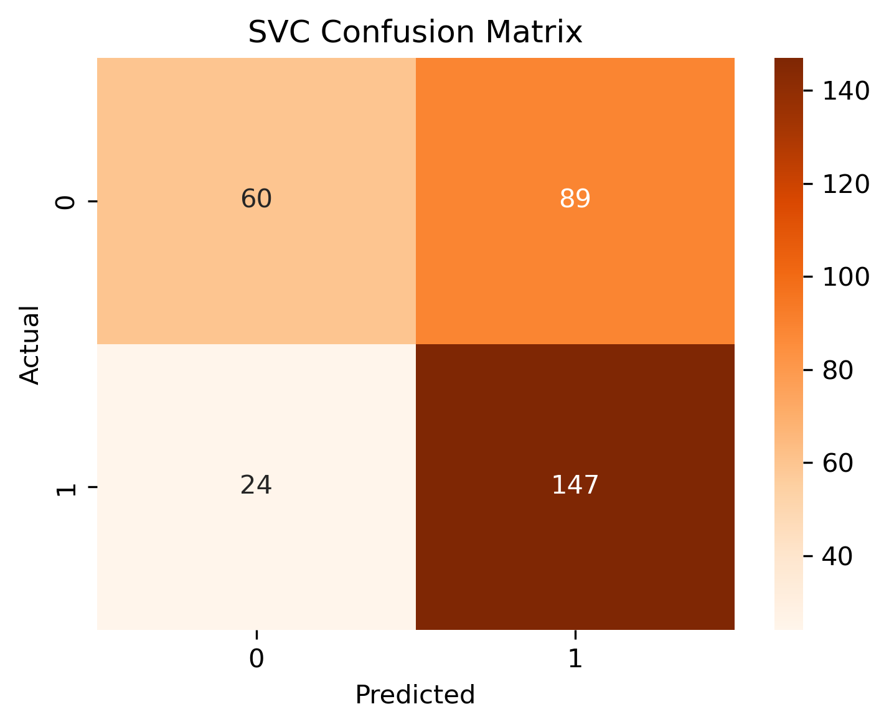
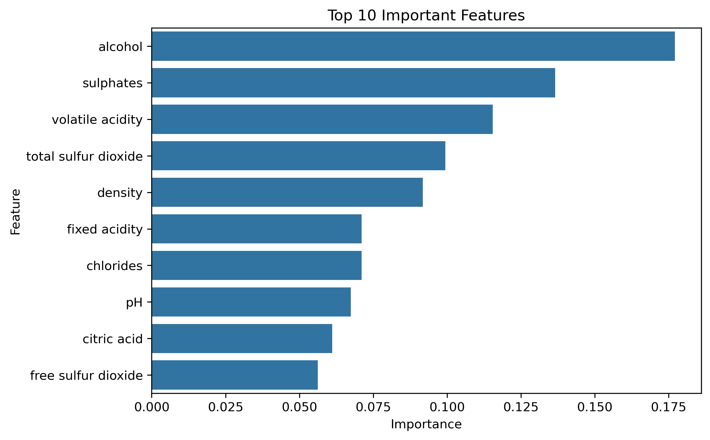

# Wine Quality Prediction

## Objective

The objective of this project is to build and compare multiple machine learning classification models to predict wine quality based on its physicochemical properties. The models are evaluated to determine which one performs best for wine quality prediction.

---

## Dataset

- **Dataset:** Wine Quality Dataset
- **Source:** UCI Machine Learning Repository / Kaggle

---

## Tools Used

- Python
- Pandas
- NumPy
- Scikit-learn
- Matplotlib
- Seaborn
- Jupyter Notebook (Anaconda)

---

## Models Used

- Random Forest Classifier
- Stochastic Gradient Descent (SGD) Classifier
- Support Vector Classifier (SVC)

---

## Project Workflow

- Imported required libraries
- Loaded the dataset
- Performed data inspection
- Checked missing values
- Removed duplicate records
- Analyzed class distribution
- Performed Exploratory Data Analysis (EDA)
- Created feature distribution plots
- Created correlation heatmap
- Converted quality scores into binary classes
- Split the dataset into training and testing sets using stratification
- Trained Random Forest, SGD, and SVC models
- Evaluated models using Accuracy, Classification Report, and Confusion Matrix
- Identified important features using Random Forest
- Compared model performance
- Added conclusion

---

## Visualizations

### Wine Quality Distribution

### Feature Distribution

### Correlation Heatmap

### Random Forest Confusion Matrix

### SGD Confusion Matrix

### Support Vector Classifier (SVC) Confusion Matrix

### Feature Importance

---

## Results

Three machine learning models were trained and compared. Their performance was evaluated using Accuracy, Classification Report, and Confusion Matrix. Random Forest Feature Importance helped identify the most influential features affecting wine quality.

---

## Conclusion

The models successfully classified wine quality based on physicochemical properties. After comparing all three models, the one with the highest accuracy can be considered the best choice for deployment.

