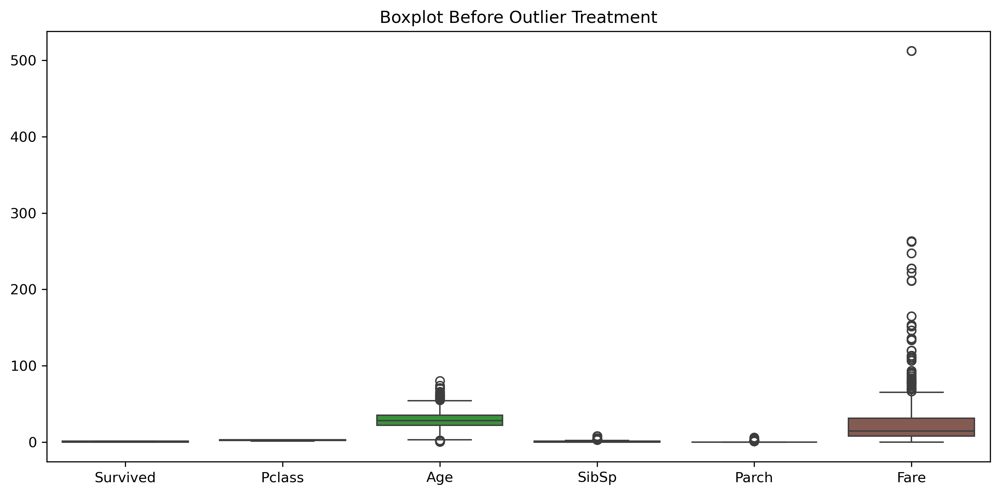
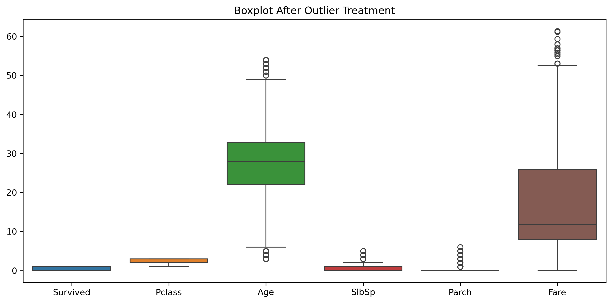

# Data Cleaning

## Objective

The objective of this project is to clean a messy dataset and prepare it for analysis by handling missing values, removing duplicate records, correcting data types, standardizing data, detecting outliers, and saving a clean dataset.

---

## Dataset

- **Dataset:** Titanic Dataset
- **Source:** Kaggle

---

## Tools Used

- Python
- Pandas
- NumPy
- Matplotlib
- Seaborn
- Jupyter Notebook (Anaconda)

---

## Project Workflow

- Imported required libraries
- Loaded the dataset
- Performed initial data inspection
- Checked missing values
- Checked duplicate records
- Generated a data quality report
- Handled missing values
- Removed duplicate rows
- Standardized text values
- Corrected data types
- Detected outliers using the IQR method
- Removed outliers
- Created a Before vs After summary
- Saved the cleaned dataset as a new CSV file
- Added conclusion

---

## Visualizations

### Boxplot Before Outlier Treatment

### Boxplot After Outlier Treatment

---

## Results

The dataset was cleaned successfully by handling missing values, removing duplicate records, correcting data types, standardizing values, and treating outliers. The cleaned dataset is ready for further analysis and machine learning.

---

## Conclusion

This project demonstrates the complete data cleaning process using Python and Pandas. The final cleaned dataset is more consistent, reliable, and suitable for analysis.
